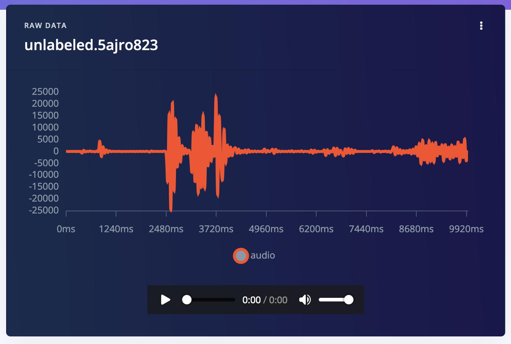
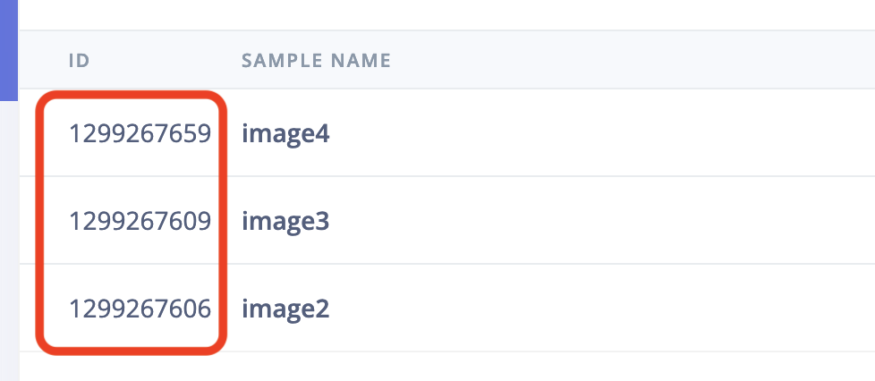
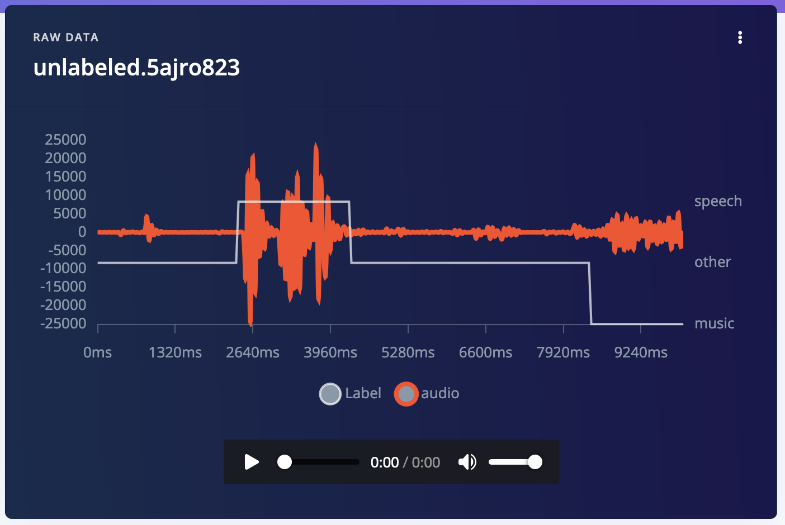

# AI labeling block: Audio Spectrogram Transformers labeling block (HuggingFace)

This is an Edge Impulse [AI labeling block](https://docs.edgeimpulse.com/studio/organizations/custom-blocks/custom-ai-labeling-blocks) that uses [Audio Spectrogram Transformers](https://huggingface.co/docs/transformers/en/model_doc/audio-spectrogram-transformer) from HuggingFace to automatically label audio data. You can use this repo as the basis for custom tasks that use big ML models to help with labeling or data quality tasks in your project.

## Use this from Edge Impulse (professional / enterprise)

If you just want to use this block as a labeling tool in your Edge Impulse project you don't need this repo. Just go to any project, select **Data acquisition > AI Actions**, choose **Audio labeling with Audio Spectrogram Transformers** (available for professional and enterprise projects only).

## Developing your own block

You can use this repository as a basis to integrate any model that's deployed using HuggingFace's Serverless Inference API. The model we're using here is [MIT/ast-finetuned-audioset-10-10-0.4593](https://huggingface.co/MIT/ast-finetuned-audioset-10-10-0.4593), but it should be easy to adapt this repository to any other model. If your desired HuggingFace model is not available through HuggingFace's APIs, see [zero-shot-object-detector-labeling-block](https://github.com/edgeimpulse/zero-shot-object-detector-labeling-block) for information on how to deploy models using Beam.cloud.

### Host the Hugging Face model to Beam.cloud

### 1. Deploying the inference server

1. Sign up for an account at [Beam.cloud](https://www.beam.cloud).
2. The Beam inference server (it's very simple) is implemented in [beam_inference_server.py](beam_inference_server.py). If you want to use a different HuggingFace model you can swap it out there.

    > You might want to lower `keep_warm_seconds` to keep cost under control. Currently the server will stay alive for 10 minutes after the last request.

3. Use Python 3.10:

    ```bash
    pyenv install 3.10.13
    pyenv local 3.10.13 
    ```

4. Install the Beam Python dependencies, and deploy:

    ```bash
    python3 -m venv .venv-beam
    source .venv-beam/bin/activate
    pip3 install -r requirements-beam.txt

    beam deploy beam_app.py:classify_audio 
    ```

4. From the output of the `beam deploy` command, parse the endpoint, and your access key:

    ```bash
    curl -X POST 'https://audio-spectrogram-transformer-XXXX-v2.app.beam.cloud' \
    -H 'Connection: keep-alive' \
    -H 'Content-Type: application/json' \
    -H 'Authorization: Bearer co9SiXXX...==' \
    -d '{}'
    ```

### Running this block locally

1. Create a new Edge Impulse project, and add some unlabeled audio, e.g. with some speech.

    

    *Unlabeled audio data with some speech and some music*

2. Create a file called `ids.json` and add the IDs of the samples you want to label. You can find the sample ID by clicking the 'expand' button on **Data acquisiton**.

    

    Add these IDs to the `ids.json` file as an array of numbers, e.g.:

    ```json
    [1299267659, 1299267609, 1299267606]
    ```

3. Install the Python dependencies:

    ```
    python3 -m venv .venv-ei
    source .venv-ei/bin/activate
    pip3 install -r requirements.txt
    ```

4. Load your Edge Impulse API key, and your HuggingFace API Key:

    ```
    export EI_PROJECT_API_KEY=ei_44...
    export BEAM_ENDPOINT= https://....app.beam.cloud
    export BEAM_ACCESS_KEY=o9SiEXK...
    ```

    > You can find your Edge Impulse API Key via **Dashboard > Keys**. You can find your HuggingFace API Key via [Access tokens](https://huggingface.co/settings/tokens) in your HuggingFace profile.

5. Run `transform.py` to label your data:

    ```bash
    python3 -u transform.py \
        --audioset-labels "speech, music" \
        --win-size-ms 1000 \
        --win-stride-ms 1000 \
        --min-confidence 0.2 \
        --data-ids-file ids.json
    ```

    **Valid labels:** Here's the full list of valid labels: [AudioSet dataset](https://research.google.com/audioset/dataset/index.html)

6. Afterwards you'll have labeled data in your project!

    

### Pushing block to Edge Impulse (enterprise only)

If you've modified this block, you can push it back to Edge Impulse so it's available to everyone in your organization.

1. Update `parameters.json` to update the name and description of your block.
2. Initialize and push the block:

    ```
    $ edge-impulse-blocks init
    $ edge-impulse-blocks push
    ```

3. Afterwards, you can run your block through **Data acquisition > AI Actions** in any Edge Impulse project.

### Proposed changes

AI Actions blocks should be able to run in 'preview' mode (triggered when you click *Label preview data* in the Studio) - where changes are _staged_ but not directly applied. If this is the case `--propose-actions <job-id>` is passed into your block. When you see this flag you should not apply changes directly (e.g. via `raw_data_api.set_sample_structured_labels`) but rather use the `raw_data_api.set_sample_proposed_changes` API. Search for this API in [transform.py](transform.py) to see how this should be used.
